# WUS 22Z

Skład zespołu:

- Błażej Gospodarek
- Jakub Smela
- Grzegorz Socha
- Hubert Truszewski

### Uruchomienie skryptu

```
./skrypt.sh CONFIGURATION_VERSION DATABASE_PORT BACKEND_PORT FRONTEND_PORT
```

Skrypt potrzebuje do działania 4 argumentów przekazywanych przy wywołaniu w konsoli:

- CONFIGURATION_VERSION - wersja konfiguracji
- DATABASE_PORT - port, na którym będzie działać serwer MySQL
- BACKEND_PORT - port, na którym będzie działać backend
- FRONTEND_PORT - port, na którym będzie działać frontend

W zależności od konfiguracji skrypt może poprosić o podanie dodatkowych parametrów:

- dla konfiguracji nr 3:
  - port na którym będzie działać serwer MySQL w trybie slave
- dla konfiguracji nr 5:
  - port na którym będzie działać serwer MySQL w trybie slave
  - port na którym będzie działać druga instacja backendu
  - port na którym będzie działać loadbalancer dla backendu

Na końcu skrypt wypisze w konsoli adres IP pod którym będzie dostępny frontend, zaś port został podany jako argument przy wywołaniu skryptu.

Skrypt korzysta z 6 innych skryptów, które wykonuje na postawionej maszynie wirtualnej celem konfiguracji na niej wymaganych usług.

### Testy

Po zakończeniu działa skryptu otrzymujemy następujący efekt:

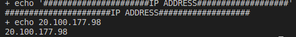

Widok strony po załadowaniu:

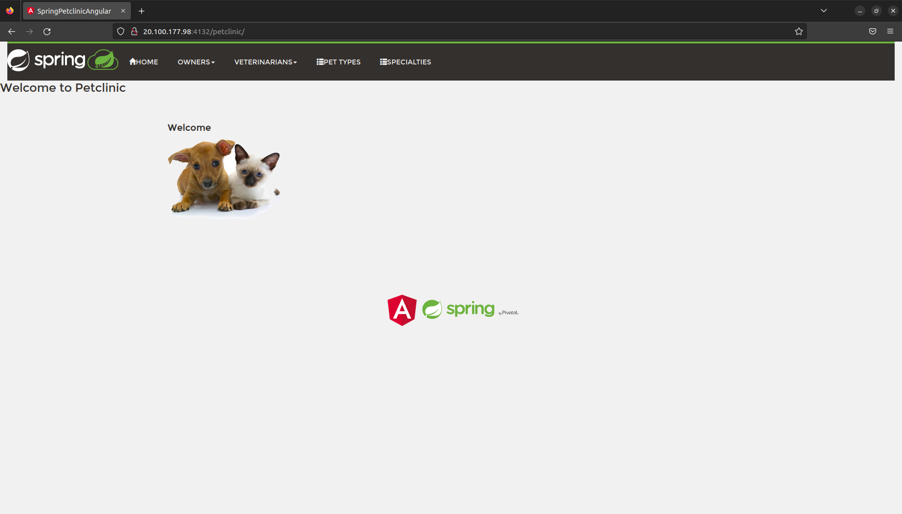

W celach testowych dodamy dwa nowe typy zwierząt: `pig` oraz `frog`. W tym celu przechodzimy do zakładki `Pet Types`, w której widzimy następujące rodzaje zwierząt:

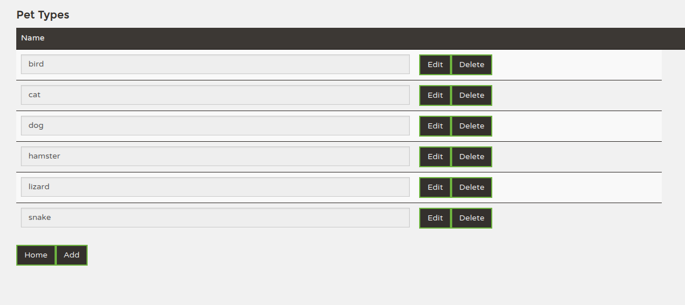

Widok zawartości tabeli `types` w bazie `petclinic` (serwer master):

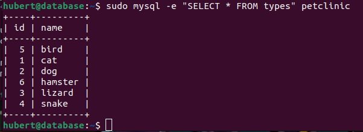

Serwer slave:

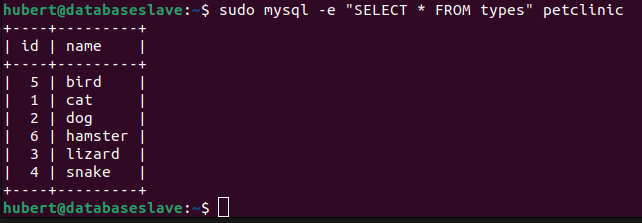

Następnie dodajemy wyżej wspomniane rodzaje zwierząt: w kolejności `pig` oraz `frog`. Rezultat w bazie:

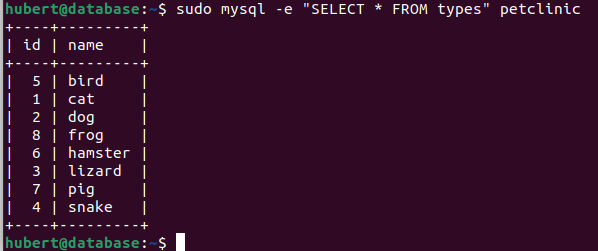

Aby sprawdzić poprawność działania replikacji sprawdzamy zawartość bazy na slave po dodaniu zwierząt:

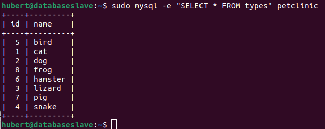

Jak widać na powyższych obrazkach replikacja bazy danych działa.

Teraz sprawdzimy działanie backendu oraz loadbalancera.

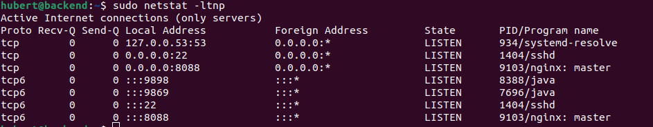

Jak widać z powyższego obrazka:

- backend działa na portach 9898 i 9869
- loadbalancer na porcie 8088

Następnie używając `kill` wyłączam instacje backendu.

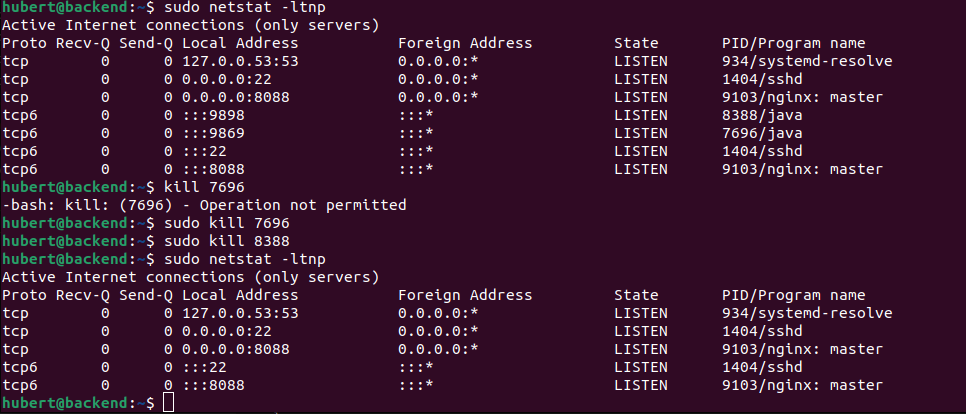

Po każdej metodzie przeładowuję stonę z rezultatem zapytania. Otrzymane wyniki:

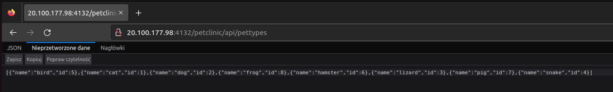
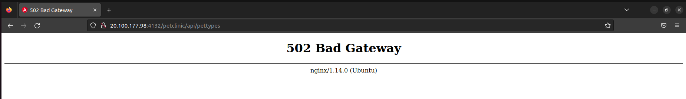

W pierwszym przypadku rolę odpowiedzi na zapytania przejął backend działający na porcie 9898, zaś po i jego wyłączeniu otrzymujemy błąd 502, ponieważ żadna ze zdefiniowanych instancji backendu nie odpowiada na zapytania z loadbalancera.

Uruchamiam ponownie backend na porcie 9869.

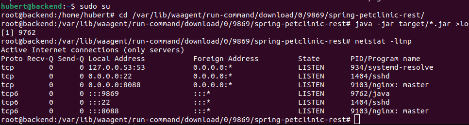

Po przeładowaniu strony otrzymuję następujący wynik:

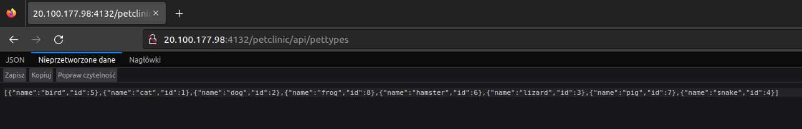

### Wnioski

W wyniku tego ćwiczenia zapoznaliśmy się ze środowiskiem Azure, jego możlwościami, sposobami konfiguracji oraz obsługą AZ CLI.
Nabyte umiejętności to:

- tworzenie resource group
- tworzenie nowych sieci i podsieci
- tworzenie maszyn wirtualnych
- wykonywanie na nich skryptów
- definiowanie reguł otwarcia portów
- uzyskiwanie publicznego adresu IP.

Pozostałe umiejętności niezwiązane bezpośrednio z Azure to:

- uruchomienie serwera MySQL w wersjach:
  - master
  - slave
- uruchomienie projektu napisanego przy użciu frameworka Spring
- sposób budowania projektu w Angularze
- konfiguracja loadbalancera przy użyciu serwera Nginx
- konfiguracja reverse proxy przy użyciu Nginx

Wykonanie tego ćwiczenia wymagało poznania narzędzi z zakresu baz danych, technologi backendu oraz frontendu. Pozyskane doświadcznie będzie na pewno przydatne w wielu projektach, zarówno w czasie studiów jak i pracy zawodowej.
