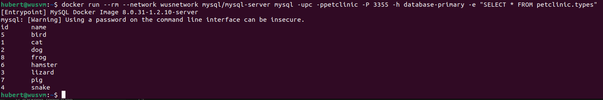
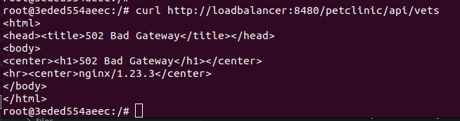

# WUS 22Z - Laboratorium 2 - Ansible

Skład zespołu:

- Błażej Gospodarek
- Jakub Smela
- Grzegorz Socha
- Hubert Truszewski

### Uruchomienie skryptu

```
./skrypt.sh CONFIGURATION_VERSION DATABASE_PORT BACKEND_PORT FRONTEND_PORT
```

Skrypt potrzebuje do działania 4 argumentów przekazywanych przy wywołaniu w konsoli:

- CONFIGURATION_VERSION - wersja konfiguracji
- DATABASE_PORT - port, na którym będzie działać serwer MySQL
- BACKEND_PORT - port, na którym będzie działać backend
- FRONTEND_PORT - port, na którym będzie działać frontend

W zależności od konfiguracji skrypt może poprosić o podanie dodatkowych parametrów:

- dla konfiguracji nr 3:
  - port na którym będzie działać serwer MySQL w trybie slave
- dla konfiguracji nr 5:
  - port na którym będzie działać serwer MySQL w trybie slave
  - port na którym będzie działać druga instacja backendu
  - port na którym będzie działać loadbalancer dla backendu

Na końcu skrypt wypisze w konsoli adres IP pod którym będzie dostępny frontend, zaś port został podany jako argument przy wywołaniu skryptu.

Skrypt wywołuje odpowiednie playbooki Ansible w zależności od konfiguracji. Zdefinowane są w nich role, które mają się wykonać, zaś zadania dla poszczególnych ról znajdują się w katalogu `roles`.

### Testy - konfiguracja nr 5

Dla zademonstrowania wywołamy skrypt z następującymi parametrami:

- port bazy danych primary - 3355
- port bazy danych secondary - 3388
- port pierwszej instancji backendu - 9898
- port drugiej instancji backendu - 9698
- port loadbalancera - 8480
- port frontnendu - 8087

_Wykonanie całego skryptu - tj. utworzenie maszyny i uruchomienie poszczególnych playbooków dla konfiguracji nr 5 zajmuje ok. 15 minut._

Po zakończeniu działania skryptu otrzymujemy następujący efekt:


Po zalogowaniu na maszynę i wydaniu polecenia `docker ps` powinniśmy widzieć uruchomionych 6 kontenerów:


Po wejściu na adres `20.100.203.227:8087` widzimy frontend angular dla petclinc:


Możemy np. wyświetlić listę zwierząt:


Dla testów dodamy dwa nowe typy zwierząt. Przed zrobieniem tego sprawdzimy stan informacji w bazie na obu istancjach.


Dodamy dwa nowe typy zwierząt: `pig` oraz `frog`. Widok strony po dodaniu:


Zrzut informacji w bazach danych:




Jak widać na powyższych obrazkach replikacja bazy danych działa.

- backend działa na portach 9898 i 9698
- loadbalancer na porcie 8480

Następnie używając polecenia `docker stop backend-primary` zatrzymuję działanie jednej instacji backendu.


Następnie wykonuję zapytanie do api. (Wykorzystuję tutaj tymczasowo stworzony kontener z obrazem Ubuntu)


W logach loadbalancera możemy znaleźć informację, że wykrył że backend-primary nie działa.


Następnie wyłączam drugi działający jeszcze backend.

W tym przypadku dostaję w odpowiedzi na zapytanie błąd `502 Bad Gateway`.



A w logach loadbalancera znajduje się informacja o niemożności połączenia do żadnej z instancji backendu:


Po wznowieniu pracy obu kontenerów z backendem (`docker start backend-primary backend-secondary`) zapytanie do api działa.


### Wnioski

W wyniku tego ćwiczenia zapoznaliśmy się ze środowiskiem Azure, jego możlwościami, sposobami konfiguracji oraz obsługą AZ CLI.
Nabyte umiejętności to:

W wyniku tego ćwiczenia dalej rozwijaliśmy umiejętności związane z AZ CLI. Nowonabytą umiejętnością jest obsługa Ansible:

- tworzenie playbooków
- tworzenie ról
- tworzenie zadań dla ról
- definiowanie własnych zbiorów inventory

Pozostałe umiejętności niezwiązane bezpośrednio z Azure i Ansible to:

- uruchomienie serwera MySQL w wersjach:
  - master
  - slave
- uruchomienie projektu napisanego przy użciu frameworka Spring
- sposób budowania projektu w Angularze
- konfiguracja loadbalancera przy użyciu serwera Nginx
- konfiguracja reverse proxy przy użyciu Nginx

Wykonanie tego zadania wymagało poznania nowej technologii jaką jest Ansible, jej możliwości oraz dostępnych rodzajów zadań. Ansible, jako narzędzie IaaC pozwala na łatwiejsze śledzenie zmian w konfiguracji oraz polepszenie współpracy w zespołach administratorów.
